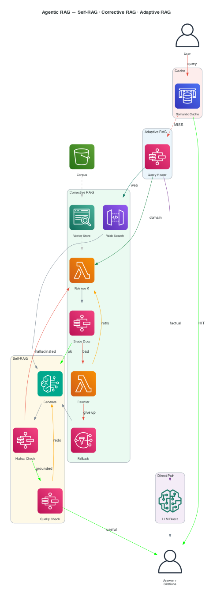
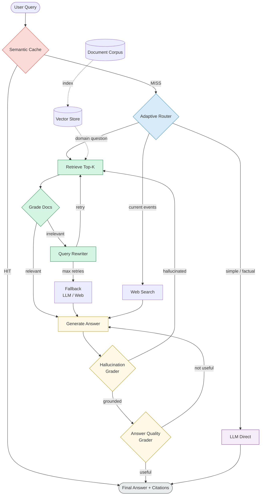
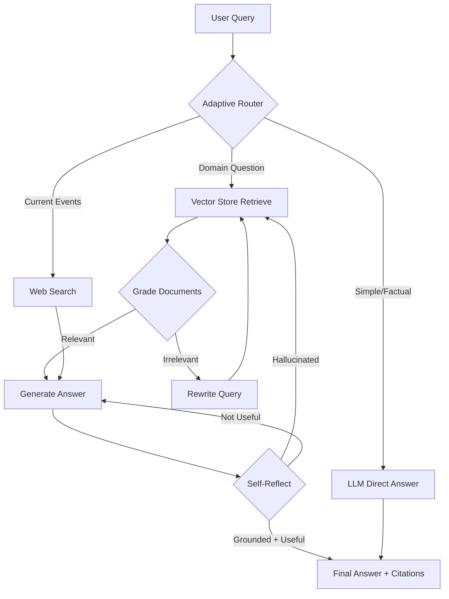

# RAG Architect- Assignment 3: Agentic RAG System — Self-RAG, Corrective RAG & Adaptive RAG

> **Course:** RAG Architect 2026
> **Submission Deadline:** March 22, 2026 — End of Day (11:59 PM)
> **Total Points:** 200 + 60 Bonus
> **Framework:** Any (LangGraph, LlamaIndex, Haystack, Google Agent SDK, Claude sdk custom — your choice)

## Table of Contents

1. [Background & Motivation](#1-background--motivation)
2. [Problem Statement](#2-problem-statement)
3. [System Architecture](#3-system-architecture)
4. [What You Must Build](#4-what-you-must-build)
5. [Grading Rubric (200 pts)](#5-grading-rubric-200-pts)
6. [Bonus Points (60 pts)](#6-bonus-points-60-pts)
7. [Submission Requirements](#7-submission-requirements)
8. [Resources & References](#8-resources--references)
9. [FAQ](#9-faq)

---

## 1. Background & Motivation

Standard Retrieval-Augmented Generation (RAG) pipelines retrieve documents and feed them blindly to an LLM — they do **not** check if retrieved content is actually relevant, do **not** know when to skip retrieval entirely, and do **not** self-correct when the answer is poor.

This assignment asks you to build a production-grade **Agentic RAG** system that reasons about its own retrieval and generation quality. You will implement three research-backed techniques:

| Technique | Core Idea | Paper |
|---|---|---|
| **Self-RAG** | The LLM reflects on and critiques its own outputs using special tokens | Asai et al., 2023 |
| **Corrective RAG (CRAG)** | Grades retrieved documents; falls back to web search if they are irrelevant | Yan et al., 2024 |
| **Adaptive RAG** | Routes each query to the cheapest pipeline tier that can answer it correctly | Jeong et al., 2024 |

**Reference implementation to study (not copy):**
LangGraph's Agentic RAG tutorial — `https://langchain-ai.github.io/langgraph/tutorials/rag/langgraph_agentic_rag/`

---

## 2. Problem Statement

### 2.1 The Challenge

A junior engineer at your company built a basic RAG chatbot over a corpus of technical documentation. Users are complaining about three things:

1. **Hallucinations** — the bot confidently gives wrong answers when the docs don't have enough information.
2. **Irrelevant retrievals** — the top-k chunks returned by the vector store are often off-topic.
3. **Unnecessary cost** — every query hits the expensive retrieval + generation pipeline, even simple factual questions the LLM already knows.

### 2.2 Your Task

Design and implement an **Agentic RAG system** that solves all three problems by combining Self-RAG, Corrective RAG, and Adaptive RAG into a unified, graph-based pipeline.

The system must:

- Accept a natural language question
- Intelligently decide **whether** to retrieve at all (Self RAG)
- Retrieve and **grade** document relevance (Corrective)
- Fall back to a secondary source (web search or LLM knowledge) when retrieval fails (Corrective)
- **Reflect** on the generated answer and retry if it is unsupported or incomplete (Self-RAG)
- Return a final, grounded answer with source citations

### 2.3 Corpus

You may choose **one** of the following corpora (or bring your own with instructor approval):

- **Option A:** Lilian Weng's ML blog posts (same as the LangGraph tutorial)
- **Option B:** Any publicly available technical documentation (e.g., Python docs, a research paper set, API docs)
- **Option C (Bonus):** Your own domain-specific corpus — document it clearly

---

## 3. System Architecture

### 3.0 Reference: LangGraph Hybrid RAG Architecture

The image below (from the LangGraph tutorial) shows the baseline agentic RAG graph you are building on top of. Study it carefully — your system must extend this with Self-RAG reflection and Adaptive routing layers.


> **Source:** [LangGraph Agentic RAG Tutorial](https://langchain-ai.github.io/langgraph/tutorials/rag/langgraph_agentic_rag/)
> The diagram shows the base graph: query → retrieve → grade → rewrite (if needed) → generate. Your assignment extends this with an Adaptive router upstream and a Self-RAG reflection loop downstream.

---

### 3.1 Target Architecture: Full Agentic RAG Pipeline



**Colour legend:**
- 🔴 Red — Semantic Cache layer
- 🔵 Blue — Adaptive RAG / Query Router
- 🟢 Green — Corrective RAG (retrieve, grade, rewrite, fallback)
- 🟡 Yellow — Self-RAG (generate + reflect)
- 🟣 Purple — Direct LLM path (no retrieval)

### 3.2 Flow Overview (Mermaid)



### 3.3 Node Descriptions

| Node | Responsibility | RAG Type |
|---|---|---|
| **Router** | Classifies query as simple/factual vs. complex/domain | Adaptive RAG |
| **Retrieve** | Fetches top-k chunks from vector store | Base RAG |
| **Grade Docs** | Binary relevance scoring per retrieved chunk | Corrective RAG |
| **Query Rewrite** | Reformulates query when docs are irrelevant | Corrective RAG |
| **Web Search / Fallback** | Supplements with live data or LLM knowledge | Corrective RAG |
| **Generate Answer** | Synthesizes context into a coherent response | All |
| **Self-Reflect** | Scores answer on groundedness and usefulness | Self-RAG |

---

## 4. What You Must Build

### 4.1 Required: Document Ingestion Pipeline

```
Raw Documents
    │
    ▼
Text Extraction (PDF / Web / txt)
    │
    ▼
Chunking Strategy (you choose — see Bonus for smarter options)
    │
    ▼
Embedding Generation
    │
    ▼
Vector Store Index
```

**Minimum requirements:**
- Load at least **3 documents / URLs** as your knowledge base
- Use any embedding model (OpenAI, HuggingFace, Cohere, etc.)
- Store in any vector DB (FAISS, Chroma, Pinecone, Weaviate, etc.)
- Basic chunking: fixed-size with overlap (`chunk_size=500`, `overlap=100`)

---

### 4.2 Required: Adaptive RAG — Query Router

Implement a router that classifies each incoming query into one of **three tiers**:

```python
class RouteQuery(BaseModel):
    """Route a user query to the most relevant datasource."""
    datasource: Literal["vectorstore", "web_search", "llm_direct"]
```

**Routing logic:**
- `llm_direct` → Simple factual questions the LLM clearly knows (e.g., "What is gradient descent?")
- `vectorstore` → Domain-specific questions about your corpus
- `web_search` → Current events or info likely not in your corpus

**Graded on:**
- [ ] Router implemented as a structured output LLM call
- [ ] At least 3 routing categories
- [ ] Router decision logged/traceable in output

---

### 4.3 Required: Corrective RAG — Document Grader + Fallback

#### Document Grader

For each retrieved document, produce a binary relevance score:

```python
class GradeDocuments(BaseModel):
    """Binary score for relevance check on retrieved documents."""
    binary_score: str  # "yes" or "no"
```

**Logic:**
- If **any** document scores `"yes"` → proceed to generation
- If **all** documents score `"no"` → trigger query rewrite + fallback

#### Query Rewriter

When documents are irrelevant, rewrite the query to be more semantically precise before retrying:

```python
# Example rewrite prompt
"Look at the input question and try to reason about the underlying
 semantic intent. Formulate an improved question."
```

#### Fallback

When re-retrieval also fails (after 1 rewrite), fall back to:
- Option A: Web search (Tavily, SerpAPI, DuckDuckGo)
- Option B: LLM's parametric knowledge with explicit uncertainty statement

**Graded on:**
- [ ] Document grader with structured output
- [ ] Query rewriter node implemented
- [ ] Fallback mechanism (web search OR LLM fallback)
- [ ] Maximum retry loop prevents infinite cycles (max_retries ≤ 3)

---

### 4.4 Required: Self-RAG — Answer Reflection

After answer generation, the system must critique its own output across two dimensions:

#### Hallucination Grader
```python
class GradeHallucinations(BaseModel):
    """Binary score: is the answer grounded in the provided documents?"""
    binary_score: str  # "yes" = grounded, "no" = hallucinated
```

#### Answer Quality Grader
```python
class GradeAnswer(BaseModel):
    """Binary score: does the answer actually address the question?"""
    binary_score: str  # "yes" = addresses question, "no" = does not
```

**Decision logic after grading:**

| Grounded | Useful | Action |
|---|---|---|
| Yes | Yes | Return final answer |
| Yes | No | Re-generate with better prompt |
| No | — | Re-retrieve and re-generate |

**Graded on:**
- [ ] Hallucination grader implemented
- [ ] Answer quality grader implemented
- [ ] Retry loop logic correctly implemented
- [ ] Loop termination after max retries

---

### 4.5 Required: Graph Assembly

Connect all nodes into a stateful graph. You may use LangGraph, a custom state machine, or any agentic framework:

**Minimum graph structure (LangGraph example):**

```python
workflow = StateGraph(MessagesState)

# Add nodes
workflow.add_node("router", route_question)
workflow.add_node("retrieve", retrieve)
workflow.add_node("grade_documents", grade_documents)
workflow.add_node("generate", generate)
workflow.add_node("rewrite_question", rewrite_question)
workflow.add_node("web_search", web_search)
workflow.add_node("self_reflect", grade_generation)

# Add edges
workflow.add_conditional_edges("router", route_to_datasource)
workflow.add_edge("retrieve", "grade_documents")
workflow.add_conditional_edges("grade_documents", decide_to_generate)
workflow.add_edge("generate", "self_reflect")
workflow.add_conditional_edges("self_reflect", grade_generation_output)
```

**Graded on:**
- [ ] All nodes present and connected
- [ ] Conditional edges implement correct routing logic
- [ ] State is correctly passed between nodes
- [ ] System handles full query lifecycle end-to-end

---

### 4.6 Required: End-to-End Demo

Your submission must include a working demo that:

1. Accepts a user question via CLI, notebook, or simple UI
2. Prints/logs each node visited (trace)
3. Returns a final answer with source citations
4. Shows at least **3 test cases**:
   - One that routes directly to LLM (no retrieval)
   - One that retrieves and grades docs as relevant → generates answer
   - One that triggers fallback (rewrite + web search or LLM fallback)

---

## 5. Grading Rubric (200 Points)

### 5.1 Core Implementation (140 pts)

| Component | Points | Criteria |
|---|---|---|
| **Document Ingestion** | 15 | Documents loaded, chunked, embedded, and indexed correctly |
| **Adaptive RAG Router** | 20 | Router classifies queries into ≥3 tiers; structured output used |
| **Corrective RAG — Grader** | 20 | Document relevance grader with binary scoring implemented |
| **Corrective RAG — Rewriter** | 15 | Query rewriter triggers on irrelevant docs; produces improved query |
| **Corrective RAG — Fallback** | 15 | Web search or LLM fallback implemented and triggered correctly |
| **Self-RAG — Hallucination Check** | 15 | Hallucination grader scores generated answer vs. source docs |
| **Self-RAG — Quality Check** | 10 | Answer usefulness grader implemented |
| **Graph Assembly** | 20 | All nodes connected; correct conditional edges; no infinite loops |
| **Retry / Loop Control** | 10 | Max retries enforced; system terminates gracefully |

### 5.2 Code Quality (30 pts)

| Criterion | Points |
|---|---|
| Clean, readable, well-structured code | 10 |
| Modular design (nodes are independent functions/classes) | 10 |
| Proper error handling and logging | 10 |

### 5.3 Evaluation & Testing (30 pts)

| Criterion | Points |
|---|---|
| 3+ test cases demonstrating all pipeline branches | 15 |
| Quantitative evaluation: report precision@k, answer relevance, or faithfulness scores | 15 |

> **Suggested evaluation tools:** RAGAS, TruLens, DeepEval, or manual scoring rubric (provide it)

---

## 6. Bonus Points (60 Points)

Bonus points are **additive** — you can earn all 60 on top of your base score.

### 6.1 Advanced Chunking Strategy (+10 pts)

Replace fixed-size chunking with one or more of the following:

| Strategy | Description |
|---|---|
| **Semantic Chunking** | Split on embedding similarity boundaries (not token count) |
| **Hierarchical / Parent-Child** | Store small chunks for retrieval, large chunks for generation |
| **Proposition Chunking** | Extract atomic factual propositions as individual chunks |
| **Late Chunking** | Embed full documents first, then chunk embeddings |

**Deliverable:** Ablation table comparing retrieval quality (precision@k) with basic vs. advanced chunking on ≥10 test queries.

---

### 6.2 Semantic Caching (+10 pts)

Implement a caching layer that:

- Stores `(query_embedding, answer)` pairs
- On new query: check cosine similarity against cached queries
- If similarity > threshold (e.g., 0.92) → return cached answer, skip pipeline
- Logs cache hit/miss rates

```
Query → [Cache Check] → HIT  → Return Cached Answer
                      → MISS → Full RAG Pipeline → Store in Cache
```

**Deliverable:** Cache hit rate on your test set; latency comparison (cached vs. uncached).

---

### 6.3 Advanced RAG Pipeline Tiers (+10 pts)

Implement Adaptive RAG router to support **3 explicit pipeline tiers**:

| Tier | When to Use | Pipeline |
|---|---|---|
| **Tier 0 — Direct** | Simple/factual; LLM knows it | LLM only, no retrieval |
| **Tier 1 — Basic RAG** | Domain Q with clear answer in docs | Retrieve → Grade → Generate |
| **Tier 2 — Advanced RAG** | Complex multi-hop Q; conflicting docs | Retrieve → Decompose → Multi-retrieve → Fuse → Grade → Generate |

**Deliverable:** Router correctly assigns queries to tiers; demo of each tier with a test question.

---

### 6.4 Bring Your Own Implementation (+15 pts)

Go beyond the LangGraph tutorial. Options include:

- **Custom framework:** Build the agentic loop without LangGraph (pure Python state machine, asyncio, etc.)
- **Multi-agent:** Use a Supervisor agent that delegates to specialized RAG sub-agents
- **Streaming:** Stream tokens to the user while grading happens asynchronously in the background
- **Custom grader:** Fine-tune or prompt-engineer a specialized grader model instead of using the same LLM
- **Tool use:** Add calculator, code interpreter, or structured data retrieval as additional tools

**Deliverable:** Written explanation (1–2 paragraphs) of what you built and why it improves on the baseline.

---

### 6.5 Architecture Diagram (+15 pts)

Recreate the system architecture as a **proper infrastructure/flow diagram**.

**Requirements:**
- Must show all nodes, edges, and decision points
- Must distinguish the three RAG layers visually (color-code or label)
- Must include data flow annotations (what state is passed between nodes)

**Tooling options (pick one):**
- **AWS Architecture Diagrams** via draw.io / Lucidchart with AWS icons
- **Mermaid.js** diagram embedded in your README
- **Excalidraw** exported as PNG/SVG
- **Any other professional diagramming tool**

**Minimum diagram content:**



**Deliverable:** Diagram image file (PNG/SVG) + source file committed to your repo.

---

## 7. Submission Requirements

### 7.1 Repository Structure

```
your-submission/
├── README.md                    # Setup instructions + design decisions
├── requirements.txt             # All dependencies pinned
├── .env.example                 # Required env vars (no real keys)
├── src/
│   ├── ingestion/
│   │   ├── loader.py            # Document loading
│   │   ├── chunker.py           # Chunking strategy
│   │   └── indexer.py           # Embedding + vector store
│   ├── nodes/
│   │   ├── router.py            # Adaptive RAG router
│   │   ├── retriever.py         # Retrieval node
│   │   ├── grader.py            # Document + answer graders
│   │   ├── rewriter.py          # Query rewriter
│   │   ├── generator.py         # Answer generation
│   │   └── fallback.py          # Web search / LLM fallback
│   ├── graph.py                 # Full graph assembly
│   └── cache.py                 # (Bonus) Semantic cache
├── notebooks/
│   └── demo.ipynb               # End-to-end demo with 3+ test cases
├── evaluation/
│   └── results.md               # Evaluation metrics + test results
├── diagrams/
│   └── architecture.png         # (Bonus) Architecture diagram
└── tests/
    └── test_pipeline.py         # Unit tests for individual nodes
```

### 7.2 What to Submit

1. **GitHub repository link** (public or shared with instructor)
2. **1-page design doc** (in your README or separate PDF) covering:
   - Framework choice and justification
   - Chunking strategy chosen and why
   - Any design decisions or trade-offs
3. **Evaluation report** (`evaluation/results.md`) with:
   - Test questions used
   - Which pipeline branch each question triggered
   - Answer quality scores (manual or automated)

### 7.3 Deadline

> **March 22, 2026 — 11:59 PM**
> Late submissions lose **10 points per day**.
> Extensions granted only for documented emergencies — email before the deadline.

---

## 8. Resources & References

### Papers

| Paper | Link |
|---|---|
| Self-RAG: Learning to Retrieve, Generate, and Critique | https://arxiv.org/abs/2310.11511 |
| Corrective RAG (CRAG) | https://arxiv.org/abs/2401.15884 |
| Adaptive-RAG | https://arxiv.org/abs/2403.14403 |

### Tutorials & Docs

| Resource | Description |
|---|---|
| LangGraph Agentic RAG Tutorial | https://langchain-ai.github.io/langgraph/tutorials/rag/langgraph_agentic_rag/ |
| LangGraph CRAG Tutorial | https://langchain-ai.github.io/langgraph/tutorials/rag/langgraph_crag/ |
| LangGraph Self-RAG Tutorial | https://langchain-ai.github.io/langgraph/tutorials/rag/langgraph_self_rag/ |
| LangGraph Adaptive RAG Tutorial | https://langchain-ai.github.io/langgraph/tutorials/rag/langgraph_adaptive_rag/ |
| RAGAS Evaluation Framework | https://docs.ragas.io |

### Tools

| Tool | Purpose |
|---|---|
| LangGraph | Graph-based agent orchestration |
| LangChain | LLM chains, tools, retrievers |
| FAISS / Chroma | Vector stores |
| Tavily | Web search API for RAG |
| RAGAS | RAG evaluation metrics |
| GPT-4o / Claude / Gemini | LLM backbone |

---

## 9. FAQ

**Q: Can I use any LLM (OpenAI, Anthropic, open-source)?**
A: Yes. Any LLM that supports structured output / function calling works. Document your choice.

**Q: Can I work in a team?**
A: Solo submissions only unless otherwise announced.

**Q: My API costs are too high — what should I do?**
A: Use a smaller model (GPT-4o-mini, Claude Haiku, Llama 3.1 8B via Ollama) for graders and keep the stronger model only for generation.

**Q: Can I use a pre-built RAG framework like LlamaIndex or Haystack?**
A: Yes, but you must implement the Self-RAG, Corrective RAG, and Adaptive RAG logic yourself — don't just call a pre-built pipeline object.

**Q: What if web search API costs money?**
A: Use the free tier of Tavily (1,000 free searches/month) or implement a simple DuckDuckGo scraper as fallback. Alternatively, implement LLM-knowledge fallback instead.

**Q: How do I evaluate without labeled data?**
A: Use RAGAS faithfulness and answer relevance metrics (they don't need ground-truth labels), or build a 10-question test set with manual answer ratings.

---

## Grading Summary

| Category | Max Points |
|---|---|
| Core Implementation | 140 |
| Code Quality | 30 |
| Evaluation & Testing | 30 |
| **Base Total** | **200** |
| Bonus: Advanced Chunking | +10 |
| Bonus: Semantic Caching | +10 |
| Bonus: Pipeline Tiers | +10 |
| Bonus: Own Implementation | +15 |
| Bonus: Architecture Diagram | +15 |
| **Maximum Possible** | **260** |

---

*Good luck. The goal is not just to get it working — it is to understand **why** each component exists and what problem it solves.*
