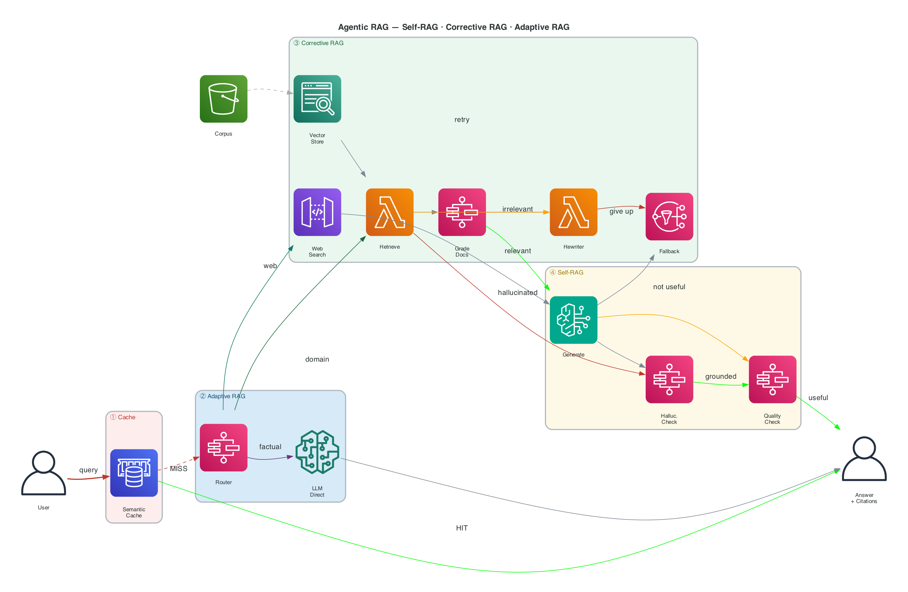

# Assignment 3 — Agentic RAG

**Course:** RAG Architect 2026 &nbsp;|&nbsp; **Due:** March 22, 2026, 11:59 PM &nbsp;|&nbsp; **Points:** 200 base + 60 bonus

Build a RAG system that thinks for itself — it decides whether to retrieve, checks if retrieved docs are useful, and reflects on its own answers before returning them.


## What to Build

You are implementing three techniques on top of a standard RAG pipeline:

| Layer | What it does |
|---|---|
| **Adaptive RAG** | Routes each query to the right tier — LLM direct, vector store, or web search |
| **Corrective RAG** | Grades retrieved docs; rewrites the query and falls back if they're irrelevant |
| **Self-RAG** | Checks the generated answer for hallucinations and usefulness; retries if needed |

**Reference:** [LangGraph Agentic RAG Tutorial](https://langchain-ai.github.io/langgraph/tutorials/rag/langgraph_agentic_rag/) — study it, don't copy it.


## Architecture



**Colour legend:** 🔴 Cache &nbsp; 🔵 Adaptive RAG &nbsp; 🟢 Corrective RAG &nbsp; 🟡 Self-RAG &nbsp; 🟣 Direct LLM

**LangGraph baseline (extend this):**


## Implementation Checklist

### Required

- [ ] **Ingest documents** — load ≥ 3 docs, chunk, embed, store in a vector DB
- [ ] **Query Router** — classify query as `llm_direct` / `vectorstore` / `web_search` using structured LLM output
- [ ] **Retrieve** — fetch top-k chunks from vector store
- [ ] **Grade Documents** — binary relevance score (`yes`/`no`) per chunk via LLM
- [ ] **Query Rewriter** — if all chunks irrelevant, rewrite the query and retry
- [ ] **Fallback** — if retry fails, use web search (Tavily) or LLM parametric knowledge
- [ ] **Generate Answer** — synthesise context into a grounded response
- [ ] **Hallucination Grader** — check if answer is supported by source documents
- [ ] **Answer Quality Grader** — check if answer actually addresses the question
- [ ] **Loop Control** — max 3 retry iterations, system must terminate gracefully
- [ ] **Demo** — notebook or CLI showing all 3 pipeline branches with source citations

### Bonus

| Feature | Points |
|---|---|
| Advanced chunking (semantic / hierarchical / proposition) + ablation table | +10 |
| Semantic cache — skip pipeline on similar past queries (cosine sim ≥ 0.92) | +10 |
| 3-tier router: Tier 0 LLM only · Tier 1 basic RAG · Tier 2 multi-hop RAG | +10 |
| Custom implementation (no LangGraph, multi-agent, streaming, etc.) | +15 |
| Architecture diagram using a proper tool (draw.io, Excalidraw, AWS icons) | +15 |


## Grading

| Category | Points |
|---|---|
| Document ingestion | 15 |
| Adaptive RAG router | 20 |
| Corrective RAG — grader | 20 |
| Corrective RAG — rewriter + fallback | 30 |
| Self-RAG — hallucination + quality graders | 25 |
| Graph assembly + loop control | 30 |
| **Code quality** (clean, modular, error handling) | 30 |
| **Evaluation** (3+ test cases + metrics) | 30 |
| **Total** | **200** |


## Submission

**What to submit:** GitHub repo link (public or shared with instructor).

**Required repo structure:**
```
your-repo/
├── README.md              # setup + design decisions
├── requirements.txt
├── .env.example
├── src/
│   ├── ingestion/         # loader, chunker, indexer
│   ├── nodes/             # router, retriever, grader, rewriter, generator, fallback
│   └── graph.py           # full pipeline assembly
├── notebooks/demo.ipynb   # end-to-end demo
└── evaluation/results.md  # test questions + scores
```

**Your README must cover:**
- Framework choice and why
- Chunking strategy and why
- Any design trade-offs you made

**Late policy:** -10 pts per day. Extensions only for documented emergencies — email before the deadline.


## Resources

**Papers**
- [Self-RAG](https://arxiv.org/abs/2310.11511) — Asai et al., 2023
- [Corrective RAG](https://arxiv.org/abs/2401.15884) — Yan et al., 2024
- [Adaptive RAG](https://arxiv.org/abs/2403.14403) — Jeong et al., 2024

**Tutorials**
- [LangGraph Agentic RAG](https://langchain-ai.github.io/langgraph/tutorials/rag/langgraph_agentic_rag/)
- [LangGraph CRAG](https://langchain-ai.github.io/langgraph/tutorials/rag/langgraph_crag/)
- [LangGraph Self-RAG](https://langchain-ai.github.io/langgraph/tutorials/rag/langgraph_self_rag/)
- [LangGraph Adaptive RAG](https://langchain-ai.github.io/langgraph/tutorials/rag/langgraph_adaptive_rag/)
- [RAGAS — evaluation framework](https://docs.ragas.io)

**Tools:** LangGraph · LangChain · FAISS / Chroma · Tavily · RAGAS · GPT-4o / Claude / Gemini


## FAQ

**Which LLM can I use?** Any that supports structured output / function calling. Document your choice.

**Which framework?** LangGraph, LlamaIndex, Haystack, custom — anything goes.

**API costs too high?** Use GPT-4o-mini, Claude Haiku, or Llama 3.1 8B (Ollama) for graders.

**No labeled data for evaluation?** Use RAGAS faithfulness + answer relevance metrics (no ground truth needed).

**Can I use a pre-built RAG object?** No — you must implement the three RAG layers yourself.
